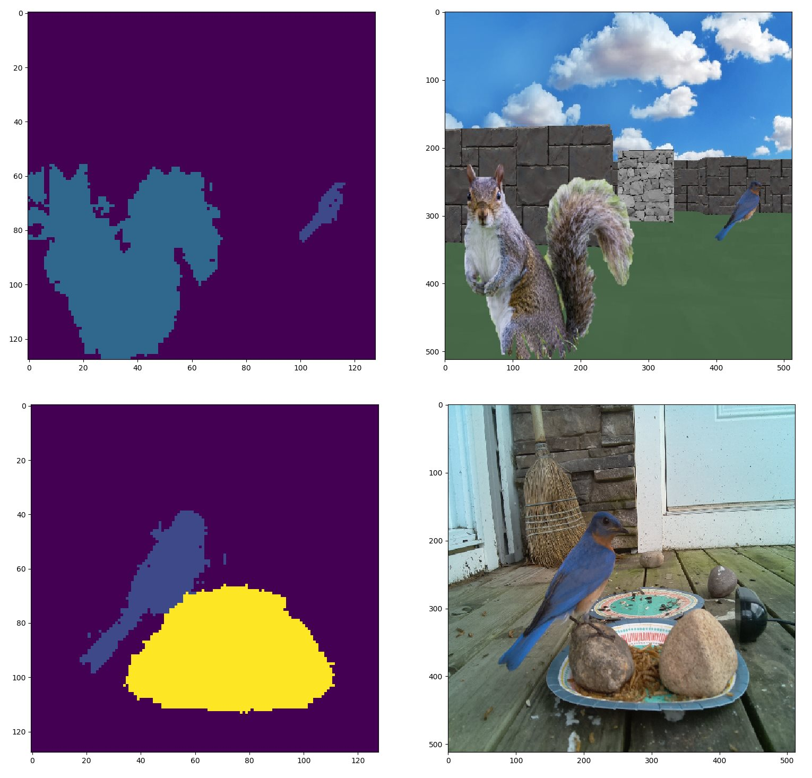
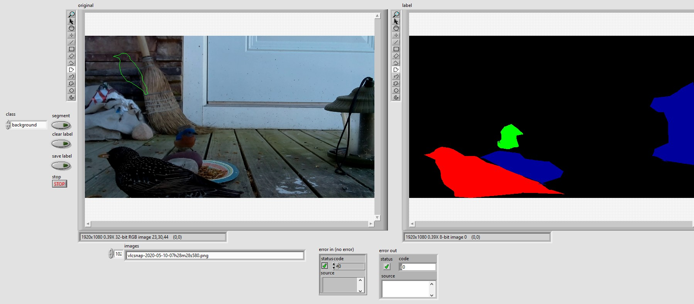

Image segmentation is the process of classifying an image pixel by pixel. This gives not only the class of objects detected, but also their shape and locations.
The model as specified in get_model.py is a u-net model. The backbone is taken from MobileNetV2 with the weights set to not be trainable. By using transfer learning
we are able to converge faster and with a smaller training set. The model is taken from the tensorflow example below:
https://www.tensorflow.org/tutorials/images/segmentation

The code expects 2 directories of images for training; image_dir and label_dir. The images contain the objects you want to detect and the labels are .png files
generated using the LabVIEW file annotate_segmentation.vi. When starting it will ask you to specify the image directory and the directory the labels will be saved.
import_data.py will expect the 2 directories to be passed to it as constants and that there will be making image and label files of the same name. If a match is
not found an error is thrown.

The model uses a custom loss function. In most image segmenation datasets the background class can be dominat. With over 90% of the classes being background it
easiest for the model to guess background for all pixles and be right enough to have a low loss function and not converge to a result we want. main.py implements
a dice_loss function that weights losses inversly proportional to the frequency of the class. If the model guesses background when the true class is a rare bird
this will result in a much higher loss than in the opposite case. This worked very well for my small bird image dataset and converged very quickly. And the
weights are automatically calculated by the import_images function. No extra work for you!

As the model is intended to run on an edge device during inference tflite_convert.py and tflite_test.py are included to quantize the model. Quantization is int8
and the resulting model can run on the Google Coral TPU.

For GPU training I have gotten TF 2.2.0 to work. Later versions I have not successfully gotten to work on GPU.
